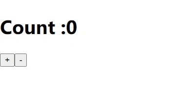
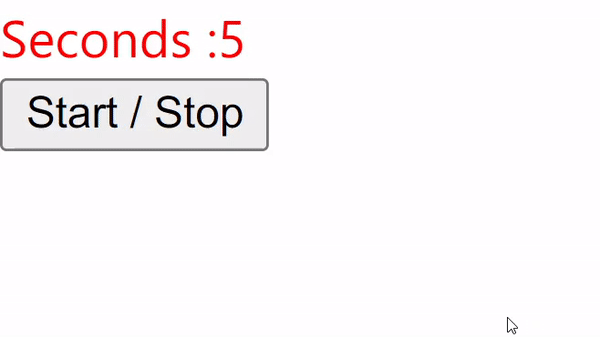

# ReactPy

**ReactPy** is a implementation of React in Python using [Brython](https://brython.info/). ReactPy application runs on the client side, which are written in **Python 3**. It's Component based and follows the same virtual DOM and Fiber architecture as ReactJS. ReactPy also supports PYX syntax which is equivalent to JSX in Javascript.

## Getting Started

Creating a ReactPy app is very simple and the process in very much inspired from ReactJS.

<p align="center">
  
</p>

### Installation

ReactPy has a PyPI package

```
pip install ReactPy
```

### Setting Up

Once ReactPy is installed, then to setup boiler plate -

1. Create an empty folder for your application.
2. Then run the following command to Initialize ReactPy

```sh
python3 -m ReactPy --init
```

### Setup live reload server

ReactPy comes with a simple live reload development server, to use start it -

```sh
python3 -m ReactPy --serve
```

This will start a development server at http://127.0.0.1:5500/

### Create a deployment build

To create a deployment build of your application -

```sh
python3 -m ReactPy --build
```

This will create a `build` directory in project folder. Then this can be very easily deployed to services like [Netlify Drop](https://docs.netlify.com/site-deploys/create-deploys/#drag-and-drop) by uploading `build` folder for deployment.

### Syntax Highlighting

To get syntax highlighting on`.pyx` files in ReactPy applications, install [ReactPy Syntax Highlighter](https://marketplace.visualstudio.com/items?itemName=RudreshVeerkhare.reactpy) in VSCODE from Visual Studio Marketplace.

## Examples

### Passing Props

```python
import ReactPy
from browser import document

def Greetings(props):
	return <h1>Hi, {" " + props["name"]}</h1>

element = <Greetings name="World!"/>
ReactPy.render(element, document.getElementById("root"))
```

### Counter

```python
import ReactPy
from browser import document

def Counter(props):
    count, setCount = ReactPy.useState(0)
    return  <div>
                <h1>Count :{count}</h1>
                <button onClick={lambda e: setCount(count + 1)}>+</button>
                <button onClick={lambda e: setCount(count - 1)}>-</button>
            </div>

element = <Counter/>
ReactPy.render(element, document.getElementById("root"))
```

<p align="center">
  
</p>

### Timer

```python
import ReactPy
from browser import document
from browser.timer import set_interval, clear_interval

def Timer(props):
    seconds, setSeconds = ReactPy.useState(props["timelimit"])
    running, setRunning = ReactPy.useState(False)

    if seconds < 1:
        setRunning(False)

    def _tick():
        setSeconds(lambda s: s - 1)

    def __effect():
        if running:
            print("Set Interval")
            __interval = set_interval(_tick, 1000)
            return lambda: clear_interval(__interval)

    ReactPy.useEffect(__effect, [running])

    color = "red" if not running else "blue"

    return
        <div>
            <div style={{"color": color}}>Seconds : {seconds}</div>
            <button onClick={lambda e: setRunning(lambda r: not r)}>Start / Stop</button>
        </div>

element = <Timer timelimit={5}/>
ReactPy.render(element, document.getElementById("root"))
```

<p align="center">
  
</p>

### Live Input

```python
import ReactPy
from browser import document

def LiveInput(props):
    value, setValue = ReactPy.useState("")

    return
        <div>
            <input value={value + ""} onInput={lambda e: setValue(e.target.value)}/>
            <h1>{value}</h1>
        </div>

element = <LiveInput/>
ReactPy.render(element, document.getElementById("root"))
```

<p align="center">
  
</p>

### API Call

```python
import ReactPy
from ReactPy.utils import lmap
from browser import document
from browser.ajax import get

def UserCard(props):
    return <div style={{
            "border": "1px solid black",
            "padding": "5px",
            "margin": "10px",
        }}>
            <h2>{props["name"]}</h2>
            <p>email: {" " + props["email"]}</p>
            <p>website: {" " + props["website"]}</p>
        </div>

def UserList(props):
    users, setUsers = ReactPy.useState([])

    def __effect():
        def _on_complete(res):
            print(res.json)
            setUsers(res.json)

        get("https://jsonplaceholder.typicode.com/users", oncomplete = _on_complete)

    ReactPy.useEffect(__effect, [])

    return  <div>
                {lmap(
                    lambda x: <UserCard name={x["name"]} email={x["email"]} website={x["website"]}/>,
                    users
                ) if len(users) > 0 else <h1>Loading...</h1>}
            </div>

element = <UserList/>
print(element)
ReactPy.render(element, document.getElementById("root"))
```

<p align="center">
  
</p>

## Contributions

Check [Contribution.md]() for Detailed Information.

## Note

This project is still in beta, so if you find any bugs please create raise an issue.
